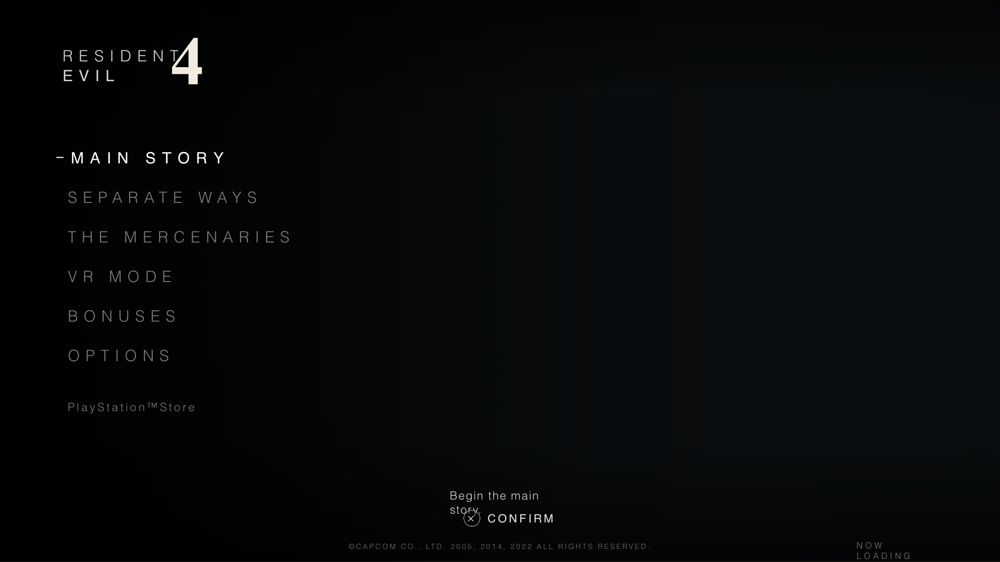

# Resident Evil: Requiem — Marshall Remix

> Cinematic main-menu prototype in the spirit of **Resident Evil: Requiem**.
> Typewriter wordmark, hand-painted grunge spine, drop-zone backdrop
> accepting image or looping video, minimal menu with ink-stamp highlights.

**🌐 Live demo:** https://mrdeathisreal.github.io/re-marshall-remix/



---

## What you're looking at

Most of the source is published in this repo so you can read it. The built
bundle that serves the live site sits under [`docs/`](./docs/).

**🔒 One file is withheld** — `src/hooks/usePersistedMedia.ts`. The repo
contains a stub that throws if called, and a note pointing to me. Without
it, `npm run build` succeeds but the media drop-zone persistence, default
backdrop fetch, and IndexedDB lifecycle don't behave as designed. That's
intentional — a portfolio piece, not a template to lift.

If you're evaluating this for a hiring decision and want the omitted file:
**nhhuy130@gmail.com**.

---

> **⚠️ License**: All Rights Reserved — see [`LICENSE`](./LICENSE). Reading
> the source for evaluation is fine. Forking, redistributing, embedding in
> another site, or copying into a personal project is not. Quoting short
> snippets in reviews with attribution is fine.

---

## Stack

- **React 19** + **TypeScript** + **Vite 7**
- **`idb`** — IndexedDB wrapper for backdrop persistence
- **Google Fonts** — Special Elite (typewriter) + Cutive Mono fallback
- **Zero CSS framework.** Plain CSS variables, hand-written keyframes.
- **No state library**, **no router** — content-light single screen.

---

## Project layout

```
.
├── README.md            ← this file
├── LICENSE              ← All Rights Reserved
├── NOTICE               ← attribution
├── preview.png
├── package.json         ← dependencies + scripts
├── vite.config.ts       ← base path + plugins
├── tsconfig*.json
├── eslint.config.js
├── index.html           ← Vite entry (source)
├── public/              ← static assets copied verbatim to build
│   └── assets/
│       ├── requiem-logo.png   ← the hand-painted wordmark
│       └── test-bg.png        ← dev default backdrop
├── src/
│   ├── App.tsx
│   ├── main.tsx
│   ├── components/
│   │   ├── Stage.tsx          ← 1920×1080 letterboxed wrapper
│   │   ├── MediaSlot.tsx      ← drop zone (consumes withheld hook)
│   │   ├── TitleImage.tsx     ← PNG logo with mix-blend-mode: screen
│   │   ├── StartButton.tsx    ← invisible hit area over "Start Game"
│   │   ├── Menu.tsx           ← 5-item controlled list, keyboard nav
│   │   ├── FooterLeft.tsx     ← description line + [F] keycap
│   │   ├── Watermark.tsx
│   │   ├── Chrome.tsx         ← LeftDarken + Grain
│   │   ├── FlashOverlay.tsx   ← imperative pulse()
│   │   ├── ResetMediaButton.tsx
│   │   └── menu-items.ts
│   ├── hooks/
│   │   ├── useStageScale.ts
│   │   └── usePersistedMedia.ts   ← 🔒 withheld; see stub
│   ├── lib/
│   │   └── media-db.ts
│   └── styles/
│       ├── global.css
│       └── menu.css
└── docs/                ← built bundle served by GitHub Pages
    ├── index.html
    ├── favicon.svg
    └── assets/
```

For the design system + implementation rationale, see
[`design.md`](./design.md) and [`skill.md`](./skill.md).

---

## Controls

| Action            | Input                                |
| ----------------- | ------------------------------------ |
| Move selection    | `↑` / `↓` or hover                   |
| Confirm           | `F`, `Enter`, `Space`, or click      |
| Start the game    | Click the **Start Game** sub-label   |
| Set backdrop      | Drop image or video onto the stage   |
| Clear backdrop    | Click **Reset Media** (top-left)     |

---

## Credits & trademarks

"Resident Evil" and related names, logos, and themes are trademarks of
**CAPCOM CO., LTD.** This project is a non-commercial fan tribute, not
affiliated with or endorsed by Capcom. All trademarks remain the property
of their respective owners.

The Requiem-style wordmark used in the title image is a fan-illustrated
re-creation, included for tribute purposes only.

---

## Reuse

Don't. See [`LICENSE`](./LICENSE).

Built and published by **Marshall Nguyễn Hoàng Huy**
([@mrdeathisreal](https://github.com/mrdeathisreal)).
